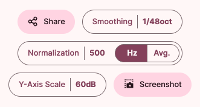

# 'Graph' Tool

In the 'Graph' tool screen, you can perform functions such as selecting a target curve or manipulating the data displayed on the graph.

## Target Selection Interface

In the target selection interface, you can select the Target Curve to use when comparing frequency response measurements.

The target curve is typically displayed as a gray dotted line graph.

## Graph Manipulation Buttons

- `Share` button: Creates a link to share the currently displayed graph.
- `Smoothing` button: Allows you to display the graph's curve smoothly or closer to the original form.
  - You can select from 1/48 octave to 1/3 octave. The default value is 1/48 octave, and the graph becomes smoother as the value increases.
- `Normalize` button: Allows you to set the criteria for aligning the currently displayed graphs.
  - 'Hz': Aligns all graphs based on the frequency of the entered value.
  - 'Avg': Aligns all graphs based on the average SPL value between 300Hz and 3000Hz.
- `Y-axis Scale` button: Allows you to set the Y-axis scale range of the graph.
- `Screenshot` button: Allows you to save the current graph as a screenshot.