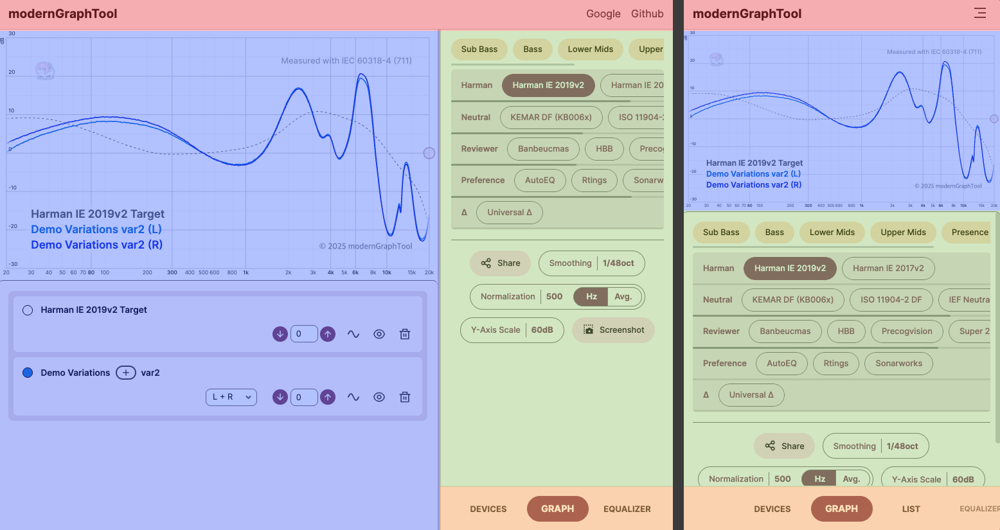

<!-- TODO: retake screenshots from SvelteKit app -->

# Understanding the User Interface

The user interface of modernGraphTool is organized into four panels, accessible via the Navigation Bar:

- **Device Panel**: Browse and search phones by brand, load multiple phones for comparison, variant and channel selection.
- **Graph Panel**: Target selector, normalization, smoothing, Y-axis scale, screenshot, share URL, frequency tutorial, preference bounds, graph color customization.
- **Equalizer Panel**: Parametric EQ with AutoEQ, real-time audio playback, filter management, device PEQ bridge, target customizer.
- **Misc Panel**: Dark mode toggle, language selector, description area, donate button.

## Desktop UI

For devices with a screen width of 1000px or more, the 'Desktop UI' is applied.
- The 'Graph Area' is placed on the left, and the panel area with the 'Navigation Bar' is placed on the right.
- You can adjust the ratio between the 'Graph Area' and the panel area by dragging the vertical divider left or right.
- The tool listing the data displayed on the graph moves to the bottom of the 'Graph Area'.

## Mobile UI

On the other hand, for mobile devices with a narrow screen width, the 'Mobile UI' is applied.
- The panel area and 'Navigation Bar' are placed sequentially below the 'Graph Area'.
- The ratio between the 'Graph Area' and the panel area cannot be adjusted.
- The tool listing the data displayed on the graph is merged into the panel area.
