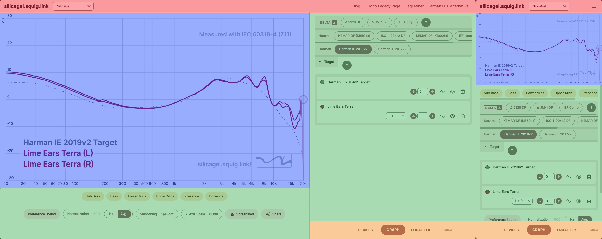

# Understanding the User Interface

The user interface of the modernGraphTool can be divided into four areas:

- 🔴 **Top Bar**: The area where the modernGraphTool logo and various link buttons are located.
- 🔵 **Graph Area**: The area where various data are displayed in graph form according to user manipulation.
- 🟢 **Tool Area**: The area where various tools for manipulating data and changing the graph are placed.
- 🟠 **Navigation Bar**: The area that displays a list of various tools and allows each tool to be displayed in the 'Tool Area'.

For devices with a screen width of 1000px or more, the 'Desktop UI' is applied.
- The 'Graph Area' is placed on the left, and the 'Tool Area' and 'Navigation Bar' are placed on the right.
- You can adjust the ratio between the 'Graph Area' and 'Tool Area' by dragging the vertical line dividing them left or right.
- The tool listing the data displayed on the graph moves to the bottom of the 'Graph Area'.

On the other hand, for mobile devices with a narrow screen width, the 'Mobile UI' is applied.
- The 'Tool Area' and 'Navigation Bar' are placed sequentially below the 'Graph Area'.
- The ratio between the 'Graph Area' and 'Tool Area' cannot be adjusted.
- The tool listing the data displayed on the graph is merged into the 'Tool Area'.