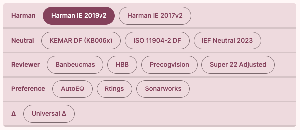
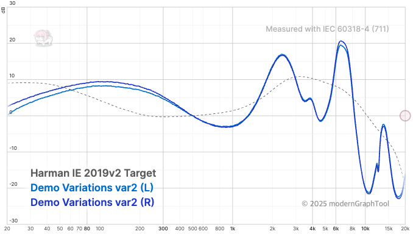
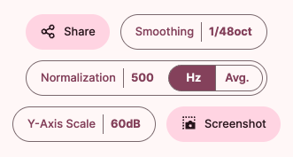

# '그래프' 도구 사용법

'그래프' 도구 화면에서는 타겟 커브를 선택하거나, 그래프에 표시되고 있는 데이터를 조작하는 등의 기능을 수행할 수 있습니다.

## 타겟 선택 인터페이스

타겟 선택 인터페이스에서는 주파수 응답 측정치를 비교할 때 사용할 타겟 커브(Target Curve)를 선택할 수 있습니다.

타겟 커브는 회색의 점선 그래프로 표시되는 것이 일반적입니다.

## 그래프 조작 버튼

- `공유` 버튼 : 현재 표시되고 있는 그래프를 공유할 수 있는 링크를 생성합니다.
- `스무딩` 버튼 : 그래프의 곡선을 부드럽게 표시하거나, 원본에 가까운 형태로 표시할 수 있습니다.
  - 1/48 옥타브부터 1/3 옥타브까지 선택할 수 있습니다. 기본값은 1/48 옥타브이며, 수치가 커질수록 그래프가 부드러워집니다.
- `정규화` 버튼 : 현재 표시되고 있는 그래프를 어떤 기준으로 정렬할 것인지 설정할 수 있습니다.
  - 'Hz': 입력된 수치의 주파수를 기준으로 모든 그래프를 정렬합니다.
  - 'Avg': 300Hz ~ 3000Hz 사이의 평균 SPL 값을 기준으로 모든 그래프를 정렬합니다.
- `Y축 스케일` 버튼 : 그래프의 Y축 스케일 범위를 설정할 수 있습니다.
- `스크린샷` 버튼 : 현재 그래프를 스크린샷으로 저장할 수 있습니다.