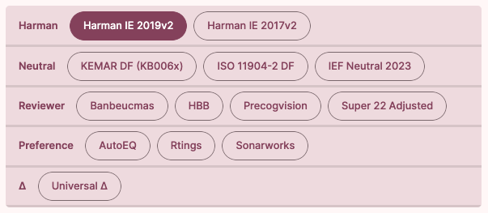
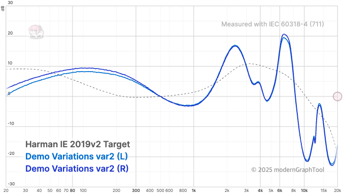
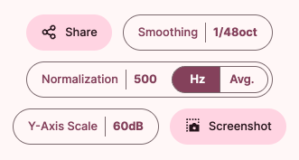

# '그래프' 도구 사용법

'그래프' 도구 화면에서는 타겟 커브를 고르거나 그래프에 표시된 데이터를 다양하게 다룰 수 있습니다.

## 타겟 선택 인터페이스

타겟 선택 인터페이스에서는 주파수 응답 측정값과 비교할 타겟 커브를 고릅니다.

타겟 커브는 보통 회색 점선 그래프로 표시됩니다.

## 그래프 조작 버튼

- `공유` 버튼 — 현재 그래프를 공유할 수 있는 링크를 만듭니다.
- `스무딩` 버튼 — 그래프 곡선을 부드럽게, 또는 원본에 가까운 형태로 표시합니다.
  - 1/48 옥타브부터 1/3 옥타브까지 고를 수 있습니다. 기본값은 1/48 옥타브이고, 수치가 커질수록 곡선이 더 부드러워집니다.
- `정규화` 버튼 — 현재 표시되는 그래프를 어떤 기준으로 정렬할지 설정합니다.
  - `Hz` — 입력한 주파수를 기준으로 모든 그래프를 정렬합니다.
  - `Avg` — 300 Hz ~ 3000 Hz 사이의 평균 SPL 값을 기준으로 모든 그래프를 정렬합니다.
- `Y축 스케일` 버튼 — 그래프 Y축의 표시 범위를 설정합니다.
- `스크린샷` 버튼 — 현재 그래프를 스크린샷으로 저장합니다.
