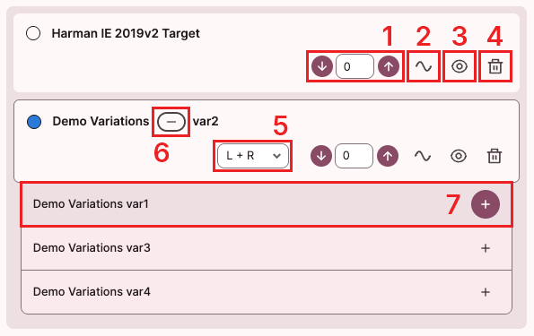

# '기기 목록' 도구 사용법

'기기 목록' 도구 화면에서는 현재 '그래프 영역'에 표시되고 있는 기기를 추가 / 수정 / 삭제할 수 있습니다.

1. Y축 오프셋 조절 버튼 : 그래프를 위/아래로 미세하기 이동시킬 수 있습니다.
2. 기준선 버튼 : 해당 그래프를 기준선으로, 나머지 그래프를 보정할 수 있습니다.
3. 그래프 표시 버튼 : 해당 그래프를 표시하거나 숨길 수 있습니다.
4. 삭제 버튼 : 해당 그래프를 삭제할 수 있습니다.
5. 채널 선택 목록 : 그래프로 표시할 채널을 선택할 수 있습니다. 
6. Variation 표시 버튼 : 해당 기기의 Variation 목록을 표시하거나 숨길 수 있습니다.
7. Variation 선택 버튼 : 선택한 Variation 그래프를 표시합니다.
    - 우측 '+' 버튼을 클릭할 경우, 선택한 Variation의 그래프가 추가됩니다.
    - 나머지 영역을 클릭할 경우, 현재 표시되고 있는 그래프가 삭제되고, 선택한 Variation으로 대체됩니다.