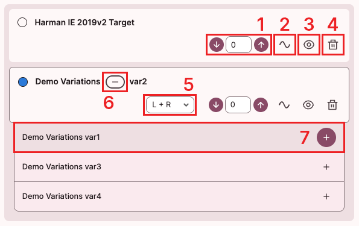

# '기기 목록' 도구 사용법

'기기 목록' 도구 화면에서는 현재 그래프 영역에 표시된 기기를 추가·수정·삭제할 수 있습니다.

1. Y축 오프셋 조절 버튼 — 그래프를 위아래로 미세하게 이동시킵니다.
2. 기준선 버튼 — 해당 그래프를 기준선으로 잡아 다른 그래프를 보정합니다.
3. 그래프 표시 버튼 — 해당 그래프를 보이거나 숨깁니다.
4. 삭제 버튼 — 해당 그래프를 삭제합니다.
5. 채널 선택 목록 — 그래프로 표시할 채널을 고릅니다.
6. Variation 표시 버튼 — 해당 기기의 Variation 목록을 펼치거나 접습니다.
7. Variation 선택 버튼 — 선택한 Variation 그래프를 표시합니다.
    - 오른쪽 `+` 버튼을 누르면 선택한 Variation의 그래프가 추가됩니다.
    - 다른 영역을 누르면 현재 그래프가 사라지고 선택한 Variation으로 교체됩니다.
