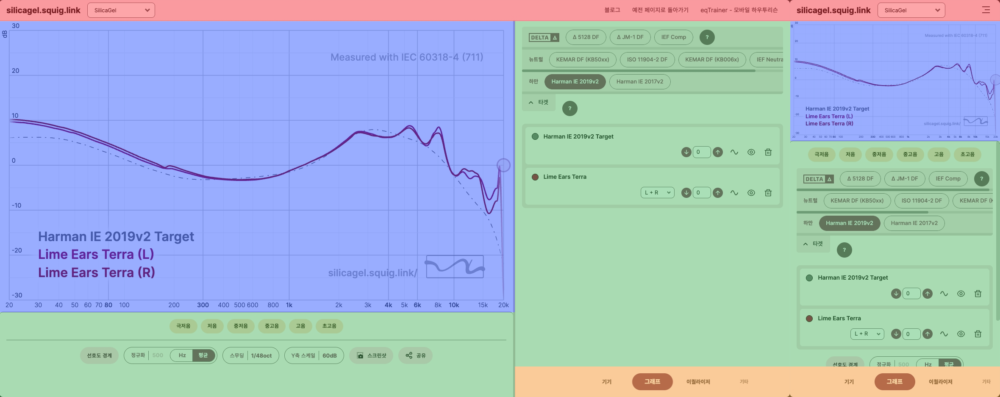

# 화면 영역 이해하기

modernGraphTool의 화면을 구성하는 사용자 인터페이스는 크게 4가지 영역으로 나뉩니다.

- 🔴 **상단 막대**: modernGraphTool의 로고와 각종 링크 버튼들이 위치하는 영역입니다.
- 🔵 **그래프 영역**: 사용자의 조작에 따라 각종 데이터가 그래프의 형태로 표시되는 영역입니다.
- 🟢 **도구 영역**: 데이터를 조작하고, 그래프에 변화를 주는 각종 도구들이 배치되는 영역입니다.
- 🟠 **네비게이션 막대**: 각종 도구 목록을 표시하고, 각 도구를 '도구 영역'에 표시할 수 있는 영역입니다. 

1000px 이상의 화면 너비를 가진 기기에서는 '데스크탑 UI'가 적용됩니다.
- '그래프 영역'이 좌측에, '도구 영역' 및 '네비게이션 막대'가 우측에 배치됩니다.
- '그래프 영역'과 '도구 영역' 사이를 나누는 수직선을 좌우로 드래그하여 두 영역 사이의 비율을 조절할 수 있습니다.
- 현재 그래프에 표시되고 있는 데이터 목록을 나열하는 도구가 '그래프 영역'의 하단으로 이동합니다.

반면, 좁은 화면 너비를 가진 모바일 기기에서는 '모바일 UI'가 적용됩니다.
- '그래프 영역' 아래에 '도구 영역'과 '네비게이션 막대'가 차례로 배치됩니다.
- '그래프 영역'과 '도구 영역' 사이의 비율을 조절할 수 없습니다.
- 현재 그래프에 표시되고 있는 데이터 목록을 나열하는 도구가 '도구 영역'으로 병합됩니다.

