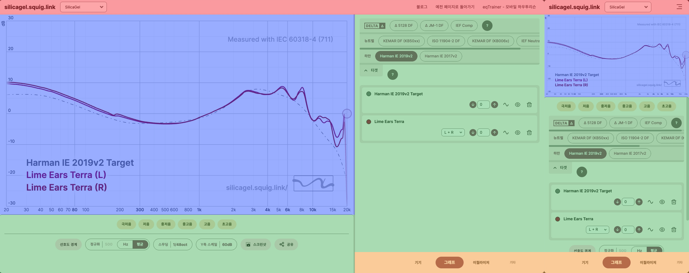

<!-- TODO: retake screenshots from SvelteKit app -->

# 화면 영역 이해하기

modernGraphTool의 사용자 인터페이스는 내비게이션 바를 통해 들어갈 수 있는 네 개 패널로 구성됩니다.

- **Device 패널** — 브랜드별 기기 검색, 비교를 위한 다중 기기 불러오기, 변형(variant)·채널 선택
- **Graph 패널** — 타겟 선택, 정규화, 스무딩, Y축 스케일, 스크린샷, 공유 URL, Frequency Tutorial, 선호도 경계, 그래프 색상 커스터마이징
- **Equalizer 패널** — AutoEQ를 곁들인 파라메트릭 EQ, 실시간 오디오 재생, 필터 관리, Device PEQ 브리지, Target Customizer
- **Misc 패널** — 다크 모드 전환, 언어 선택, 설명 영역, 후원 버튼

## 데스크톱 UI

화면 너비가 1000px 이상인 기기에서는 데스크톱 UI가 적용됩니다.

- 그래프 영역이 왼쪽, 패널 영역과 내비게이션 바가 오른쪽에 배치됩니다.
- 가운데 수직 구분선을 좌우로 드래그해 그래프 영역과 패널 영역의 비율을 조절할 수 있습니다.
- 현재 그래프에 표시 중인 데이터 목록 도구는 그래프 영역의 아래쪽으로 이동합니다.

## 모바일 UI

화면이 좁은 모바일 기기에서는 모바일 UI가 적용됩니다.

- 패널 영역과 내비게이션 바가 그래프 영역 아래에 차례로 배치됩니다.
- 그래프 영역과 패널 영역의 비율은 조절할 수 없습니다.
- 현재 그래프에 표시 중인 데이터 목록 도구는 패널 영역에 합쳐집니다.
